<div align="center">

# 🌧️ Forecast Bust Detection

**AI-based forecast confidence and uncertainty for medium-range NWP over India**

Flags *where* and *when* a numerical weather forecast is likely to fail badly (a **forecast bust**), explains *why*, and checks itself against real NCMRWF forecasts and IMD observations.


</div>

## Walkthrough video

<!-- platform-walkthrough-video -->

https://github.com/user-attachments/assets/ac085f85-cfeb-4851-9044-eef667b6c06e

<sub><b>71 s · 1080p.</b> Video not playing? <a href="docs/media/platform-walkthrough.mp4">Download platform-walkthrough.mp4</a>.</sub>

One real bust, start to finish. On 6 June 2015 the NCMRWF Day-6 forecast gave Goa **33.2 mm** of rain and **0 mm** fell. The video asks whether the platform could have known:

| Chapter | What you see |
|---|---|
| **01 · Controls** | Pick a real 2015 run (or the synthetic 2026 scenario), the variable and the lead day |
| **02 · Real case study** | The NCMRWF run of 1 June 2015 verified against IMD gridded rainfall, with KPIs and outcomes by day |
| **03 · Outcome map** | Four lenses (outcome, predicted risk, error, observed) on real state boundaries |
| **04 · State detail** | Goa flagged at **36% bust risk** *before* the event, with the drivers and rule flags behind it |
| **05 · AI briefing** | Gemini explains the bust from server-side evidence and never changes a number |
| **06 · Reality check** | IMDAA reanalysis shows the actual weather (Cyclone Ashobaa); model AUC 0.82 on this case |
| **Under the hood** | Real datasets, stack and the dependency-free API |

The walkthrough closes on the headline result: **58 of 93** real rainfall busts (62%) were rated elevated or high risk in advance across the four 2015 runs (Jun 14/22 · Jul 20/37 · Aug 18/23 · Sep 6/11). The trade-off is a 60–80% false-alarm ratio per run, which is why the risk is presented as a flag for attention, not a verdict.

---

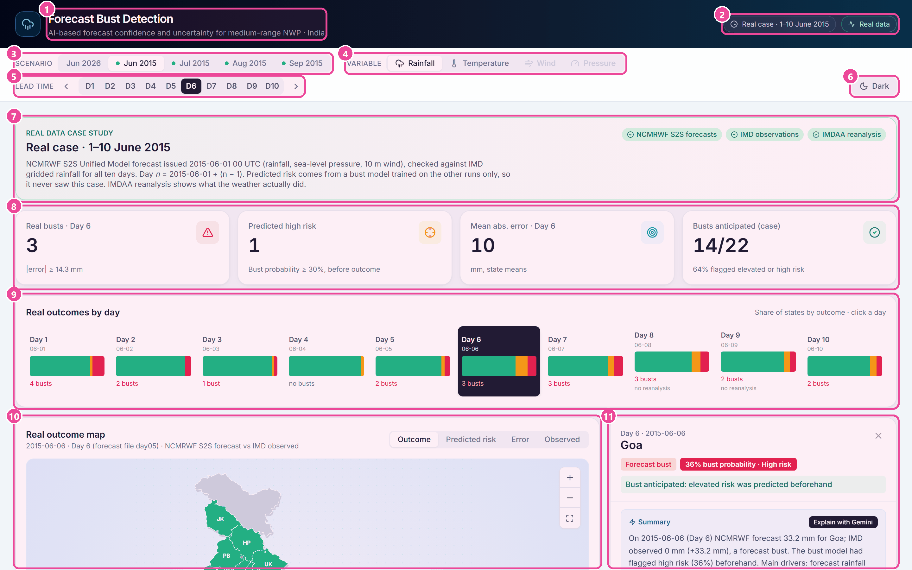

| # | Component | What it does |
|---|---|---|
| **1** | **Brand bar** | Product name and scope: medium-range NWP over India |
| **2** | **Data badges** | Which scenario is loaded and whether it is **Real data** or **Synthetic data**. The app never mixes the two without saying so |
| **3** | **Scenario switch** | `Jun 2026` = synthetic 10-day forecast · `Jun / Jul / Aug / Sep 2015` = real NCMRWF hindcast case studies (green dot = real) |
| **4** | **Variable switch** | Rainfall and Temperature are live. Wind and Pressure stay disabled until paired observation records exist for them |
| **5** | **Lead-time selector** | Day 1 to Day 10, drives every panel on the page |
| **6** | **Theme toggle** | Light and dark mode, remembered in `localStorage` |
| **7** | **Case header** | Which forecast run is being verified, against what, and the no-leakage guarantee |
| **8** | **KPI tiles** | Real busts on this day, states predicted high-risk *before* the outcome, mean absolute error, busts anticipated across the whole case |
| **9** | **Outcomes by day** | Share of states that busted, had a large error, or held, for each of the 10 days. Click a day to jump to it |
| **10** | **Outcome map** | Choropleth of real state boundaries, coloured by outcome, predicted risk, error, or observed value |
| **11** | **State detail** | Everything about the selected state and day, from forecast vs observed to model drivers, rule flags and reanalysis |

---

## Table of contents

▶️ [Walkthrough video](#walkthrough-video)

1. [The problem: what is a forecast bust?](#1-the-problem-what-is-a-forecast-bust)
2. [Highlights](#2-highlights)
3. [Platform tour](#3-platform-tour)
   - [3.1 Real case studies](#31-real-case-studies-jun--sep-2015)
   - [3.2 Real observations & verification](#32-real-observations--verification)
   - [3.3 Live weather and dark mode](#33-live-weather-and-dark-mode)
4. [System architecture](#4-system-architecture)
5. [Backend workflows](#5-backend-workflows)
   - [5.1 Real data pipeline](#51-real-data-pipeline)
   - [5.2 Bust probability computation](#52-bust-probability-computation)
   - [5.3 Gemini case briefing](#53-gemini-case-briefing)
6. [Methodology in depth](#6-methodology-in-depth)
   - [6.1 Synthetic engine](#61-synthetic-engine)
   - [6.2 Real-data engine](#62-real-data-engine)
7. [JSON API reference](#7-json-api-reference)
8. [Datasets & ingestion](#8-datasets--ingestion)
9. [Getting started](#9-getting-started)
10. [Configuration](#10-configuration)
11. [Project structure](#11-project-structure)
12. [Design system](#12-design-system)
13. [Limitations & honest caveats](#13-limitations--honest-caveats)
14. [Tech stack](#14-tech-stack)
15. [Credits & data sources](#15-credits--data-sources)

---

## 1. The problem: what is a forecast bust?

A numerical weather prediction (NWP) model is usually right *on average*, but some forecasts fail badly. These are the heavy-rain events forecast as dry, or the heat that arrives 8 °C hotter than predicted. Forecasters call these **busts**. They cause most of the real-world damage and erode trust in the forecast.

This project answers four questions for **25 Indian states** at **lead times Day 1–10**, for **rainfall** and **maximum temperature**:

| Question | How the platform answers it |
|---|---|
| **Where is today's forecast likely to bust?** | A bust probability (0–100%) and confidence tier (High / Medium / Low) per state and lead day |
| **Why?** | Transparent meteorological reasons (active weather system, deep low, rapid pressure change, IMD heavy-rain category, heat-wave criteria, lead-time error growth, historical analogues) plus the model features that raised the probability |
| **Would this have worked in reality?** | Real NCMRWF forecasts from 2015 are scored against IMD observations, with a bust model that never saw the case it predicts |
| **What actually happened?** | IMDAA reanalysis diagnoses the weather systems (e.g. Cyclone Ashobaa, June 2015) behind each real bust |

**Bust definition.** A forecast busts when its absolute error exceeds the **90th percentile (P90)** of errors. For the synthetic engine that is the region's short-range (Day 1–3) P90, floored at 15 mm or 2 °C. For real data it is the pooled P90 over all pairs (14.3 mm for rainfall, 5.1 °C for temperature). The threshold is fixed across lead times, so longer leads bust more often, which is the behaviour a forecaster expects.

---

## 2. Highlights

- 🗺️ **Offline India map.** The choropleth of the official Indian state boundaries is bundled as TopoJSON and projected with `d3-geo`. It needs no map API or key.
- 🧠 **Two-model ensemble.** L2 logistic regression (60%) is blended with a k-nearest-neighbour analogue estimate (40%), and each component is shown separately.
- 🔍 **Explainability first.** Every probability comes with rule-based reasons and the top ML drivers. The LLM **only narrates** numbers the engine already computed.
- ✅ **Verified on real data.** 1,100 real rainfall pairs and 1,000 real temperature pairs (NCMRWF S2S vs IMD), scored **leave-one-run-out**.
- 🌀 **Real case studies.** Four 10-day hindcasts (Jun–Sep 2015) with hit / miss / false-alarm scoring and IMDAA weather-system diagnosis.
- 🤖 **Gemini briefings.** One-click analyst prose. The server rebuilds all evidence itself, so the client can never inject text into the prompt.
- ⚙️ **One engine, two hosts.** The same TypeScript engine runs in the browser *and* in the dependency-free Node API server.
- 🌓 **Light and dark themes.** Every chart, map and badge uses shared colour tokens.

---

## 3. Platform tour

### 3.1 Real case studies (Jun – Sep 2015)

Pick any 2015 run in the **Scenario** switch. The page then verifies one real NCMRWF forecast against what IMD observed, day by day. Day *n* = run date + (*n* − 1). The predicted risk comes from a bust model **trained on the other three runs only**, so it never saw the case.

#### Case header and KPIs

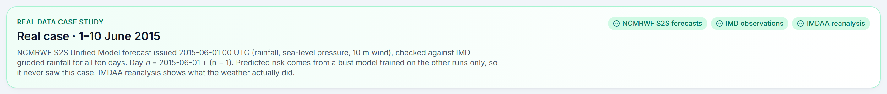

The **Busts anticipated** tile is the headline metric: the share of real busts in the whole case that the model had already rated elevated or high risk (14/22 = 64% for June 2015).

#### Real outcomes by day

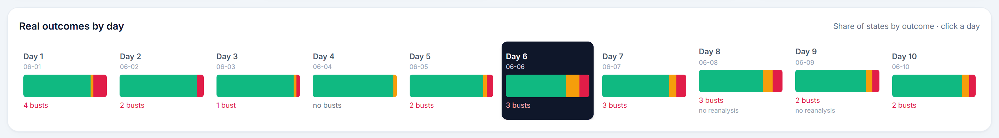

Each bar is the share of the 25 states that **busted** (red), had a **large error** (amber, ≥ 60% of the threshold), or stayed **within tolerance** (green). "No reanalysis" marks days where an IMDAA wind component is missing.

#### Outcome map and state detail

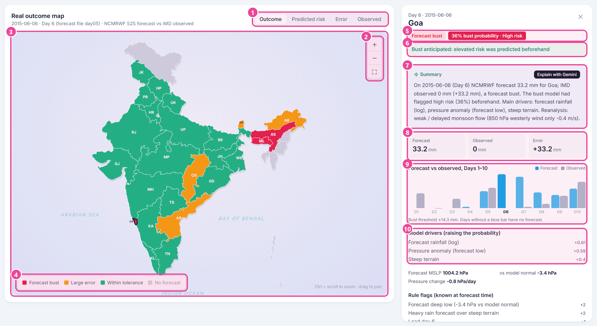

| # | Component | Details |
|---|---|---|
| **1** | **Map modes** | *Outcome* (bust / large / ok) · *Predicted risk* (model probability before the event) · *Error* (forecast − observed) · *Observed* (IMD value) |
| **2** | **Zoom controls** | Zoom in, zoom out, reset. `Ctrl + scroll` zooms, drag pans, and plain scroll still scrolls the page |
| **3** | **Choropleth** | 25 analysed states. States outside the analysis are grey. The selected state is outlined |
| **4** | **Legend** | Colours are shared with the heatmap and badges via `src/theme.ts` |
| **5** | **Outcome + risk badges** | The real outcome next to the out-of-fold bust probability and its tier |
| **6** | **Verdict** | *Bust anticipated*, *Missed bust*, *False alarm* or *Forecast held*: did the risk call match reality? |
| **7** | **Summary / Gemini** | A deterministic summary is always shown. **Explain with Gemini** replaces it with an LLM briefing |
| **8** | **Forecast / observed / error** | State-mean values for the selected day |
| **9** | **Days 1–10 chart** | Forecast (blue) vs observed (grey) for the whole case, with the bust threshold |
| **10** | **Model drivers** | Features that pushed this probability up, with their contributions |

Below the visible area the panel continues with forecast MSLP and pressure change, **rule flags** known at forecast time (deep low, steep terrain, forecast ≥ P95, lead day) with a rule score, and **what the weather actually did** according to IMDAA (850 hPa wind, vorticity, temperature, 200 hPa wind and shear).

<table>
<tr>
<td width="50%">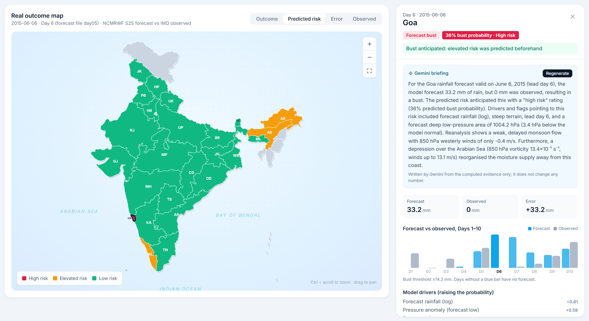<br><sub><b>Predicted risk mode.</b> Only Goa was rated high risk before Day 6, and it busted. The panel shows a live Gemini briefing.</sub></td>
<td width="50%">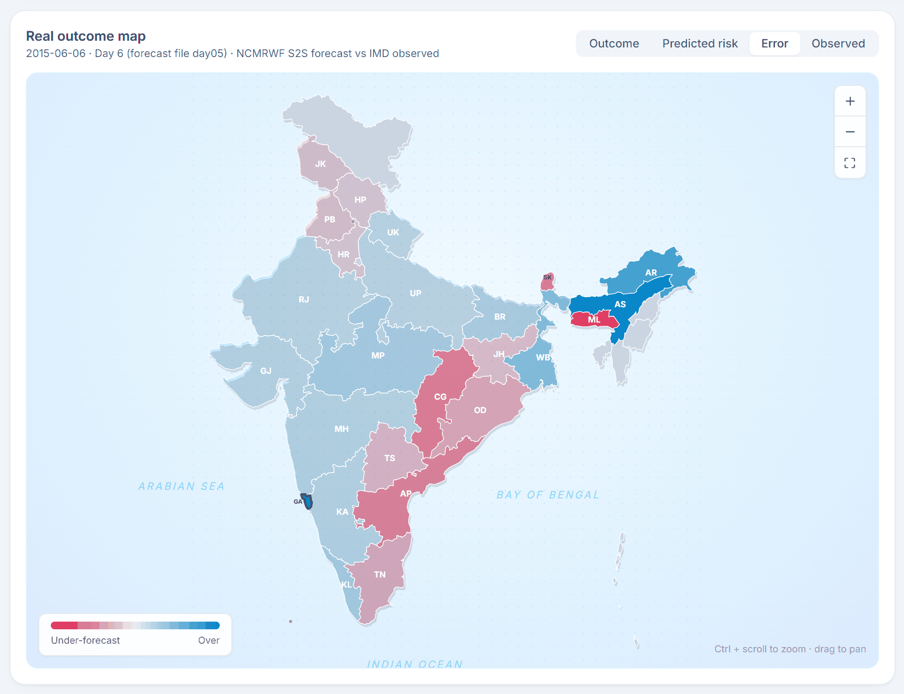<br><sub><b>Error mode.</b> Signed forecast − observed error per state. Rose = under-forecast, blue = over-forecast.</sub></td>
</tr>
</table>

#### Weather systems and model evaluation

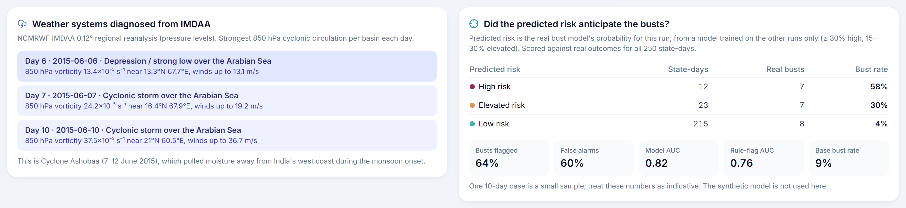

- **Left:** The strongest 850 hPa cyclonic circulation per basin each day, diagnosed from IMDAA. For June 2015 it picks out **Cyclone Ashobaa** over the Arabian Sea, which pulled moisture away from the west coast during monsoon onset.
- **Right:** The honest scorecard. High-risk state-days busted **58%** of the time and low-risk ones **4%**, against a 9% base rate. The model AUC is **0.82** and the transparent rule flags alone reach **0.76**.

#### Gemini analyst briefing

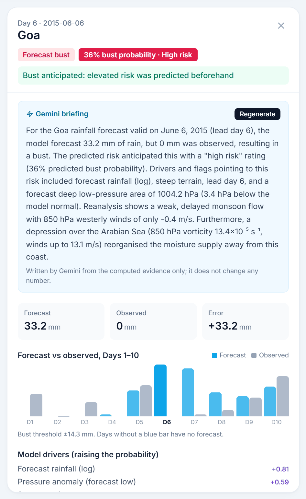

**Explain with Gemini** sends only `{caseId, day, region, variable}`. The server rebuilds the evidence from its own engine: forecast, observation, error, threshold, probability, drivers, rule flags, IMDAA signals and the state's record across all runs. It then asks Gemini for a 90–130 word post-event briefing.

The prompt forbids computing, changing or inventing any number, and the UI footer repeats that: *"Written by Gemini from the computed evidence only; it does not change any number."*

See [5.3 Gemini case briefing](#53-gemini-case-briefing) for the request sequence.

<br clear="right">

#### Temperature case

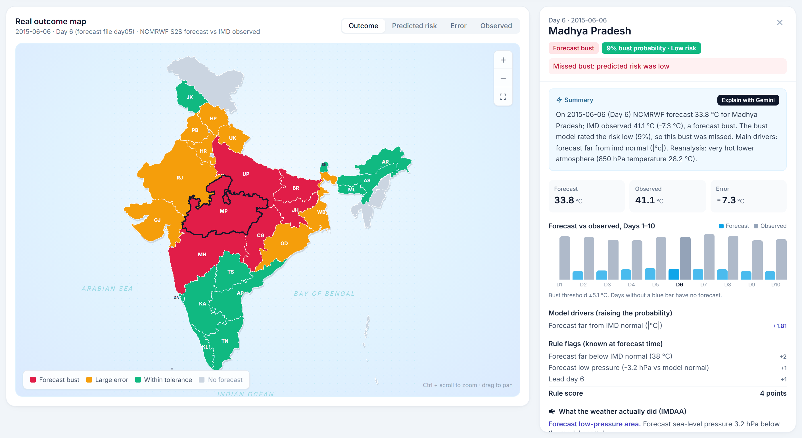

Switching **Variable → Temperature** re-scores the same run for maximum temperature. Here Madhya Pradesh is a **missed bust**: forecast 33.8 °C, observed 41.1 °C, with a predicted risk of only 9%. The platform surfaces misses as plainly as hits. Temperature forecasts are S2S 925 hPa temperature corrected to surface Tmax with MOS (see [§6.2](#62-real-data-engine)).

---

### 3.2 Real observations & verification

This section sits below every scenario and uses **only real data**.

#### Rainfall verification: NCMRWF vs IMD

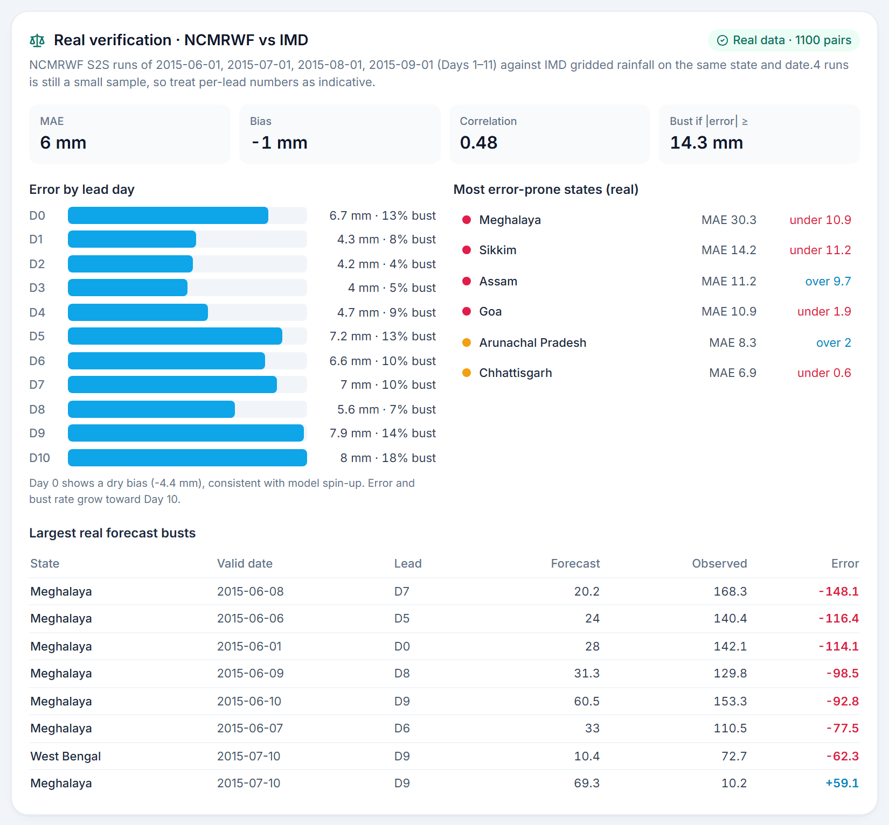

1,100 forecast/observation pairs. Error grows from about 4 mm at Days 1–4 to 6–8 mm at Days 5–10, and the bust rate reaches 18% at Day 10. Day 0 shows a **dry bias** (−4.4 mm) from model spin-up. The largest busts are **orographic heavy rain in Meghalaya and Sikkim**, which is strongly under-forecast.

<table>
<tr>
<td width="50%">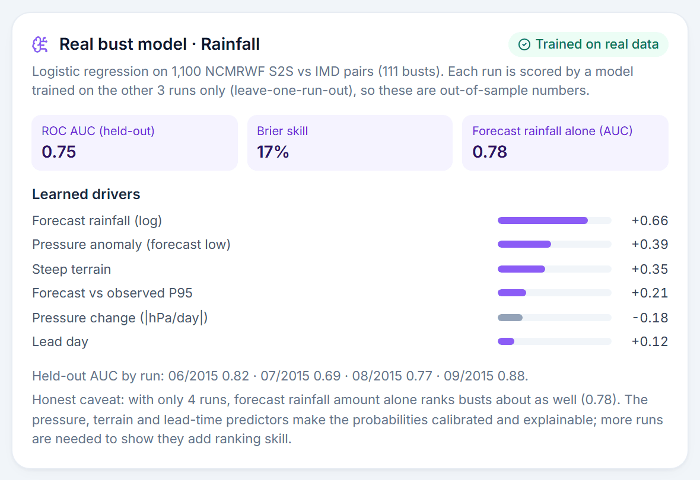<br><sub><b>Real bust model (rainfall).</b> Logistic regression on 1,100 pairs (111 busts), scored leave-one-run-out: AUC 0.75, Brier skill 17%. The caveat is stated in the UI: forecast rainfall alone scores 0.78, so more runs are needed to prove the extra predictors add ranking skill.</sub></td>
<td width="50%">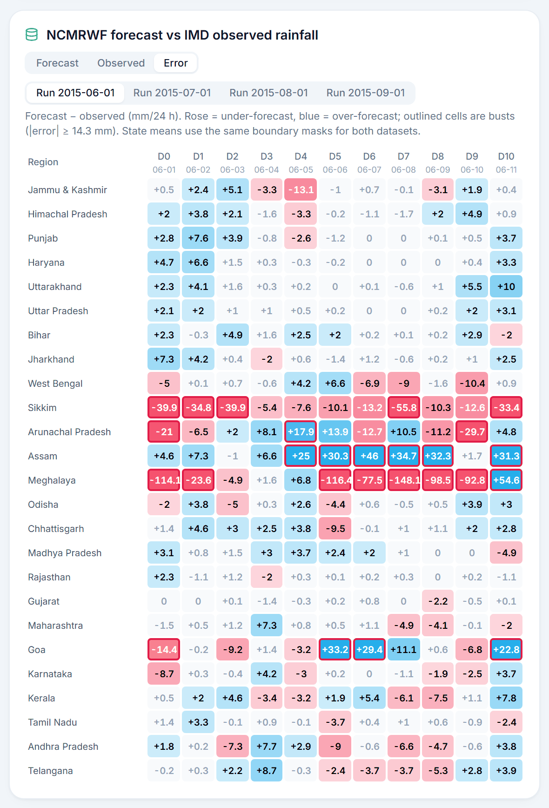<br><sub><b>Forecast / Observed / Error grid</b> for every state × lead day of each run. Outlined cells are busts. Both datasets use identical state boundary masks.</sub></td>
</tr>
</table>

#### Temperature verification

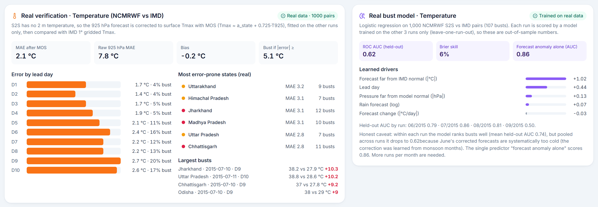

MOS correction cuts MAE from **7.8 °C (raw 925 hPa) to 2.1 °C**. The error grows from about 1.5 °C (Day 2) to 2.7 °C (Day 9). The temperature bust model uses **magnitude** features (|forecast − IMD normal|, |forecast change|, …), because signed features flipped between runs. Its per-run AUCs are 0.79–0.86, but the pooled AUC is 0.62 because June comes out systematically too cold; the UI states this.

#### IMD rainfall climatology, data sources and system status

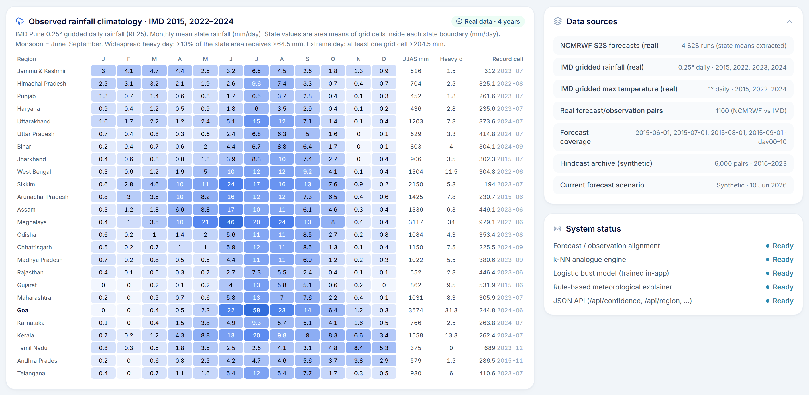

Monthly mean state rainfall from IMD 2015 and 2022–2024, with monsoon (JJAS) totals, widespread heavy-rain days and the record grid cell. These observed June means **replace** the hand-set rainfall climatology in the engine at load time. The side cards list every data feed with its real or synthetic status, and the readiness of each engine component.

---

### 3.3 Live weather and dark mode

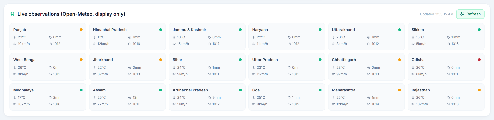

The **Live observations** panel fetches current temperature, rainfall, wind and pressure for all 25 states from [Open-Meteo](https://open-meteo.com) (free, no key). It is **display only** and never feeds the bust calculation. The dot on each card shows that state's forecast confidence for the selected day.

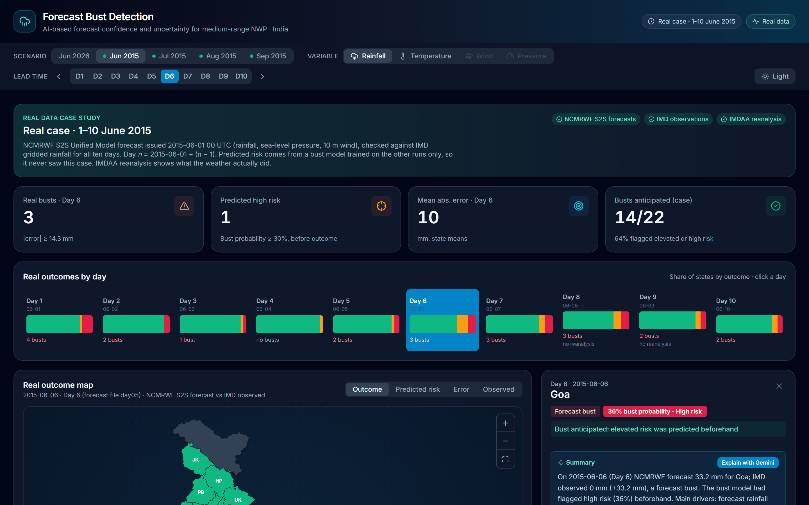

Dark mode is a `dark` class on `<html>`, set before first paint from the saved preference or the system setting. Components don't use `dark:` variants. `src/index.css` remaps the light utilities under `.dark`, and SVG and chart colours use CSS variables.

---

## 4. System architecture

[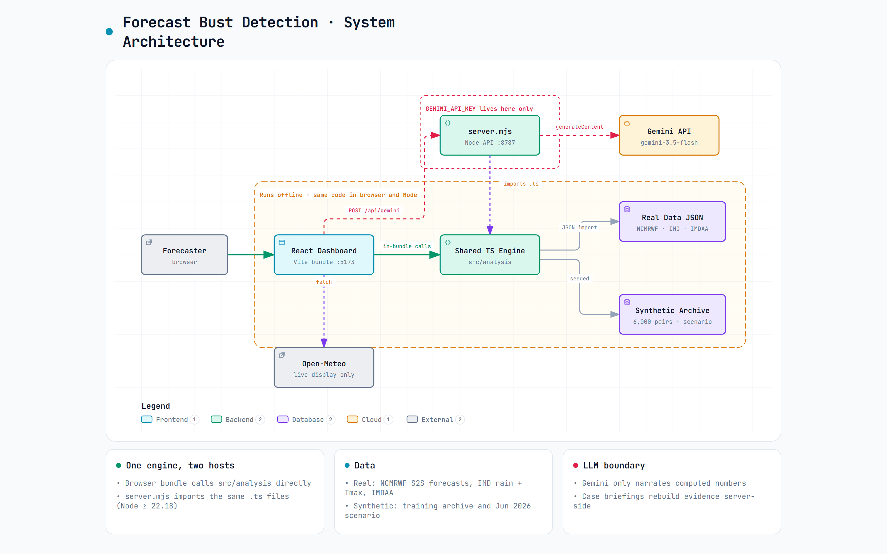](https://iabdullahslash.github.io/AI-Based-Forecast-Bust-Detection/diagrams/system-architecture.html?present=1)

**[▶ Open the interactive diagram ↗](https://iabdullahslash.github.io/AI-Based-Forecast-Bust-Detection/diagrams/system-architecture.html?present=1)** · [JSON source](docs/diagrams/system-architecture.architecture.json)

**Key design decisions**

| Decision | Why |
|---|---|
| **The engine (`src/analysis/`) is shared by browser and server** | The dashboard calls it in-bundle, so the whole app works offline and instantly. `server.mjs` imports the *same* `.ts` files through Node ≥ 22.18 type stripping, so the JSON API can never disagree with the UI |
| **The server has no dependencies** | Plain `node:http`, which serves `dist/` plus `/api/*`. Nothing to patch or audit |
| **The Gemini key is server-only** | `GEMINI_API_KEY` is read only by `server.mjs` and must never be renamed to `VITE_*`, or Vite would embed it in the browser bundle |
| **Data is extracted once, offline** | Python scripts turn multi-GB NetCDF/GRD into small JSON files in `src/data/`. The raw `dataset/` folder isn't needed at runtime |
| **Results are memoised** | Module-level `Map`s keyed by `region|day|variable`, so repeated queries are free |

**Engine code constraints.** Everything under `src/analysis/` and `src/data/` must use explicit `.ts` import extensions, `import type` for types, only erasable TS syntax (no enums, namespaces or parameter properties) and no browser-only APIs. JSON is imported with `with { type: 'json' }`.

---

## 5. Backend workflows

### 5.1 Real data pipeline

[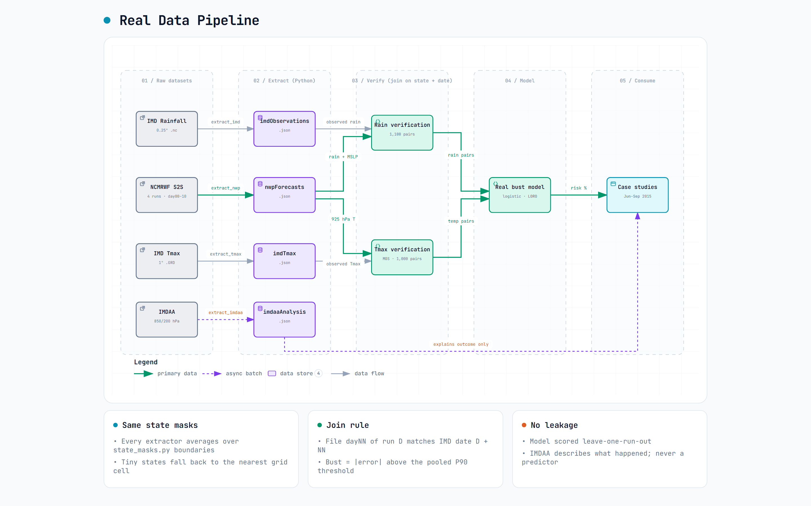](https://iabdullahslash.github.io/AI-Based-Forecast-Bust-Detection/diagrams/real-data-pipeline.html?present=1)

**[▶ Open the interactive diagram ↗](https://iabdullahslash.github.io/AI-Based-Forecast-Bust-Detection/diagrams/real-data-pipeline.html?present=1)** · [JSON source](docs/diagrams/real-data-pipeline.dataflow.json)

1. **Extract.** Four Python scripts read the raw grids and average them over **identical state-boundary masks** (`scripts/state_masks.py` decodes the bundled TopoJSON, and tiny states fall back to the nearest grid cell). Each writes one JSON file to `src/data/`.
2. **Join.** `verification.ts` pairs NCMRWF forecasts with IMD rainfall on *state + valid date*. File `dayNN` of a run initialised on date D matches IMD date D + NN; this was checked empirically, since ±1 day correlates worse. `tempVerification.ts` does the same for temperature after MOS correction.
3. **Label.** Each pair is a bust if |error| ≥ the pooled P90 threshold.
4. **Model.** `realModel.ts` fits a logistic bust model **leave-one-run-out**: each run's probabilities come from a model trained on the other three.
5. **Consume.** `caseStudy.ts` combines the out-of-fold risk, transparent rule flags and IMDAA diagnostics into per-state, per-day case cells. **IMDAA explains outcomes but is never used as a predictor**, since it describes what actually happened.

### 5.2 Bust probability computation

This is the flow of `getRegionData(region, day, variable)` in `src/analysis/forecastEngine.ts`, which drives the synthetic view and `/api/confidence`.

[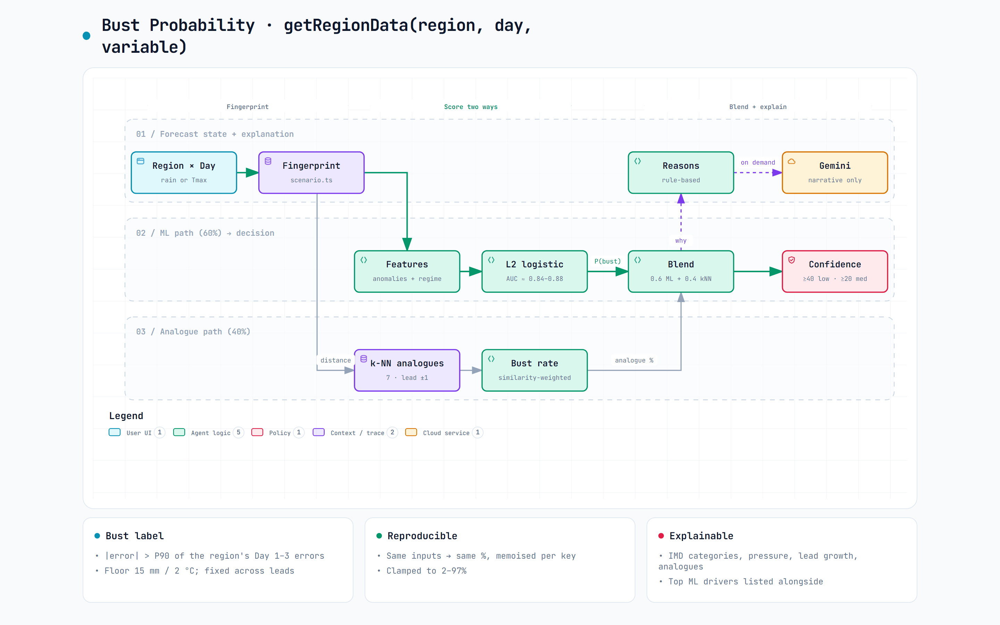](https://iabdullahslash.github.io/AI-Based-Forecast-Bust-Detection/diagrams/bust-probability.html?present=1)

**[▶ Open the interactive diagram ↗](https://iabdullahslash.github.io/AI-Based-Forecast-Bust-Detection/diagrams/bust-probability.html?present=1)** · [JSON source](docs/diagrams/bust-probability.workflow.json)

1. **Fingerprint.** `scenario.ts` returns the forecast state for the region and day: rainfall, temperature, wind, pressure, pressure tendency, the dominant weather regime, and the named system and its intensity.
2. **ML path (60%).** Features (log rainfall intensity, temperature and pressure anomalies vs climatology, wind, |pressure tendency|, lead time, one-hot regime) go into an L2 logistic regression trained in-process on the synthetic archive, with 2023 held out.
3. **Analogue path (40%).** k-NN over the archive at lead ±1 day. The distance mixes log-rainfall, anomalies, wind, pressure, tendency, lead and regime mismatch. The **7** closest, one per historical event, give a similarity-weighted bust rate.
4. **Blend.** `0.6 × ML + 0.4 × analogue`, clamped to 2–97%.
5. **Confidence.** **Low** ≥ 40%, **Medium** 20–40%, **High** < 20%.
6. **Explain.** Rule-based reasons plus the ML drivers. Gemini can narrate these on demand but never alters them.

### 5.3 Gemini case briefing

[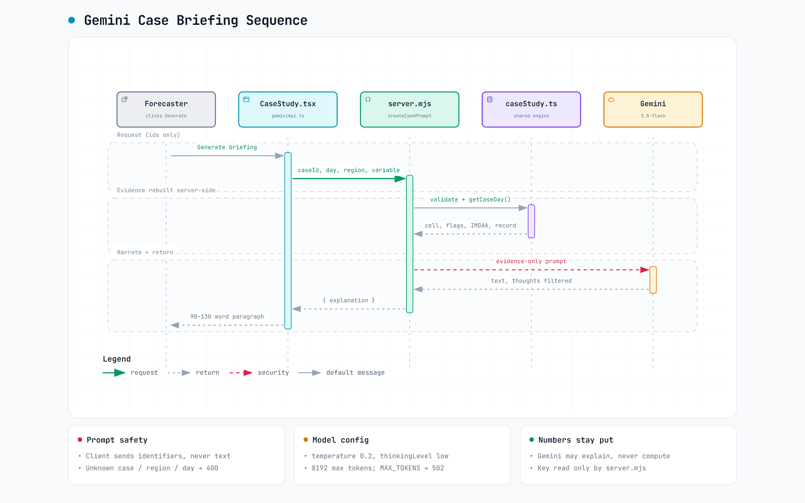](https://iabdullahslash.github.io/AI-Based-Forecast-Bust-Detection/diagrams/gemini-briefing.html?present=1)

**[▶ Open the interactive diagram ↗](https://iabdullahslash.github.io/AI-Based-Forecast-Bust-Detection/diagrams/gemini-briefing.html?present=1)** · [JSON source](docs/diagrams/gemini-briefing.sequence.json)

The request carries **identifiers only**. The server validates them (unknown case, region or day → HTTP 400), rebuilds the evidence from `caseStudy.ts`, and sends Gemini an evidence-only prompt. Model settings: `temperature 0.2`, `thinkingLevel: 'low'`, `maxOutputTokens 8192`. Thinking tokens count against that cap, so a small cap truncates the briefing. `thought` parts are filtered out, and a `MAX_TOKENS` finish returns HTTP 502 rather than a truncated paragraph. The synthetic view's `POST /api/gemini/explanation` follows the same pattern and additionally sanitises and truncates every evidence field.

---

## 6. Methodology in depth

### 6.1 Synthetic engine

| Step | Implementation | File |
|---|---|---|
| Hindcast archive | ~6,000 seeded, deterministic forecast/observation pairs (2016–2023, leads 1–10). Error grows with lead and depends on the regime | `src/data/syntheticArchive.ts` |
| Bust threshold | P90 of the region's **Day 1–3** absolute errors, floored at 15 mm / 2 °C | `src/analysis/metrics.ts` |
| ML model | L2 logistic regression, trained on 5,250 pairs and tested on 750 held-out 2023 pairs. Rainfall AUC 0.876 / Brier 0.111; temperature AUC 0.838 / Brier 0.119 | `src/analysis/model.ts` |
| Analogues | k = 7, lead ±1, one per event | `src/analysis/forecastEngine.ts` |
| Regimes | Cyclone, Monsoon depression, Western disturbance, Heat wave, Active monsoon, Break monsoon, Heavy rainfall, Monsoon trough, Fair weather | `src/types/index.ts` |
| Current scenario | Named systems with per-region `[start, peak, end]` day windows | `src/data/scenario.ts` |

**Meteorological reasons** generated per region and day:

| Tag | Triggered when |
|---|---|
| `System` | A named weather system influences the region (or: none, so the regime is stable) |
| `Dynamics` | Pressure tendency ≥ 2.5 hPa/day, or pressure ≥ 6 hPa below the June normal |
| `Intensity` | Forecast rain in IMD *heavy* (≥ 64.5 mm), *very heavy* (≥ 115.6) or *extremely heavy* (≥ 204.5) categories · heat-wave criteria (Tmax ≥ 40 °C and ≥ 4.5 °C above normal) · wind ≥ 45 km/h |
| `History` | Forecast above the observed IMD June P95/P99 for the state · the state's real NCMRWF-vs-IMD error record |
| `Lead time` | Day ≥ 4 and historical MAE ≥ 1.3× the Day 1 MAE |
| `Analogues` | How many of the 7 closest analogues busted, and the closest one |
| `ML model` | Top positive ML feature contributions |

### 6.2 Real-data engine

| Component | Details | File |
|---|---|---|
| Rainfall verification | 1,100 pairs · MAE 6 mm · bias −1 mm · r = 0.48 · bust ≥ 14.3 mm (floor 10 mm) | `src/analysis/verification.ts` |
| Temperature MOS | `Tmax ≈ a_state + 0.725·T925`, fitted leave-one-run-out · MAE 7.8 → 2.1 °C · bust ≥ 5.1 °C | `src/analysis/tempVerification.ts` |
| Rainfall bust model | Features: log forecast rain, forecast / observed P95, pressure anomaly vs the model's own climatology, \|pressure change\|, steep terrain, lead day · LORO AUC 0.75, Brier skill 17% | `src/analysis/realModel.ts` |
| Temperature bust model | Magnitude features: \|forecast − IMD normal\|, \|forecast change\|, log rain, \|pressure anomaly\|, lead · per-run AUC 0.79–0.86, pooled 0.62 | `src/analysis/realModel.ts` |
| Case studies | One per S2S run. Risk tiers: ≥ 30% high, 15–30% elevated. Rule flags use forecast-time fields only. Reports hit rate, false alarms, model vs rule AUC | `src/analysis/caseStudy.ts` |
| Steep terrain set | Meghalaya, Sikkim, Arunachal Pradesh, Kerala, Karnataka, Goa, Uttarakhand, Himachal Pradesh, Jammu & Kashmir, where grid-scale models under-resolve orographic rain | `src/analysis/realModel.ts` |

---

## 7. JSON API reference

Start with `npm run server` (or `npm start`) on **port 8787**. All `GET` endpoints return JSON. Invalid parameters return `400 {"error": "..."}`.

| Method | Endpoint | Parameters | Returns |
|---|---|---|---|
| `GET` | `/api/confidence` | `day=1..10`, `variable=rainfall\|temperature` | Confidence, bust probability (blended, ML, analogue), forecast, weather system and reasons for all 25 regions |
| `GET` | `/api/region` | `name`, `day`, `variable` | Full result, analogues, lead-time error curve and explanation for one region |
| `GET` | `/api/heatmap` | `variable` | Region × Day 1–10 bust-probability matrix |
| `GET` | `/api/error-prone` | `variable` | Regions with at least one low-confidence day |
| `GET` | `/api/model` | none | Held-out verification metrics for both synthetic bust models |
| `GET` | `/api/nwp` | none | Per-state values extracted from the NCMRWF NetCDF files |
| `GET` | `/api/imd` | none | IMD observed summaries and monsoon averages per state |
| `GET` | `/api/verification` | `pairs=true` (optional) | Real rainfall verification (add `pairs=true` for all raw pairs) |
| `GET` | `/api/temperature-verification` | `pairs=true` (optional) | Real temperature verification after MOS |
| `GET` | `/api/real-model` | `variable` | Real leave-one-run-out bust model summary |
| `GET` | `/api/case` | `id=2015-06-01`, `day`, `variable` | Case cells for every state, IMDAA basin systems and case evaluation |
| `POST` | `/api/gemini/explanation` | `{evidence}` | Gemini briefing for the synthetic view (needs `GEMINI_API_KEY`) |
| `POST` | `/api/gemini/case-briefing` | `{caseId, day, region, variable}` | Gemini briefing for a real case; the server rebuilds the evidence |

**Example**

```bash
curl "http://localhost:8787/api/confidence?day=7&variable=rainfall"
```

```json
{
  "scenario": { "issuedAt": "2026-06-10T00:00Z", "label": "Synthetic 10-day forecast issued 10 Jun 2026, 00 UTC" },
  "day": 7,
  "variable": "rainfall",
  "regions": [
    {
      "region": "Jammu & Kashmir",
      "confidence": "high",
      "bustProbability": 3,
      "mlProbability": 4,
      "analogueProbability": 0,
      "forecastValue": 3,
      "unit": "mm",
      "weatherSystem": null,
      "regime": "Fair weather",
      "reasons": ["No organised weather system forecast; regime is stable, which historically favours skill.", "…"]
    }
  ]
}
```

---

## 8. Datasets & ingestion

Raw data lives in `dataset/` (gitignored; only needed to re-extract):

| Path | Contents | Extract with | Output |
|---|---|---|---|
| `dataset/s2s/*.nc` | NCMRWF S2S hindcast runs 2015-06-01 / 07-01 / 08-01 / 09-01, day00–10: rainfall `APCP-sfc`, MSLP `PRMSL-msl`, 10 m wind `UGRD/VGRD-10m`, temperature at 925/850 hPa | `npm run extract:nwp` | `src/data/nwpForecasts.json` |
| `dataset/IMD/RF25_ind<YEAR>_rfp25.nc` | IMD 0.25° daily rainfall (NetCDF-3) | `npm run extract:imd` | `src/data/imdObservations.json` |
| `dataset/IMD/Tmax/Maxtemp_MaxT_<YEAR>.GRD` | IMD 1° daily Tmax (binary little-endian float32, 31×31 grid from 7.5°N / 67.5°E, 99.9 = missing) | `npm run extract:tmax` | `src/data/imdTmax.json` |
| `dataset/IMDAA/*.nc` | IMDAA 0.12° reanalysis, 850/200 hPa T/U/V, 3-hourly | `npm run extract:imdaa` | `src/data/imdaaAnalysis.json` |

File naming for S2S: `<variable>_ICYYYYMMDD_dayNN.nc`, e.g. `APCP-sfc_IC20150601_day05.nc`. Rainfall is treated as mm/day. Everything except rainfall covers day01–10 only, and S2S has no 2 m temperature (hence the MOS step).

**Python requirements** for the extractors:

```bash
pip install numpy h5py scipy matplotlib
```

**Map boundaries.** `scripts/build-map.mjs` reduces the state GeoJSON from [udit-001/india-maps-data](https://github.com/udit-001/india-maps-data) (official Indian boundary) to a small TopoJSON bundled with the app:

```bash
node scripts/build-map.mjs <india.json>
```

---

## 9. Getting started

### Prerequisites

- **Node.js ≥ 22.18** (the server runs the TypeScript engine through native type stripping)
- **Python 3.10+** (only to re-extract the datasets)
- A **Gemini API key** (optional; only for the *Explain / Generate with Gemini* buttons)

### Install and run

```bash
npm install
```

For **development**, run the API server and the Vite dev server in two terminals. Vite proxies `/api` to port 8787.

```bash
npm run server
```

```bash
npm run dev
```

Open <http://localhost:5173>.

For a **production-style run**, build once, then serve the built app and API together on port 8787:

```bash
npm run build
```

```bash
npm start
```

Open <http://localhost:8787>.

There is no separate test runner or linter; `npm run build` (`tsc -b` + `vite build`) is the type check. To check engine output without the UI, query the API or import `src/analysis/forecastEngine.ts` directly with `node`.

### npm scripts

| Script | What it does |
|---|---|
| `npm run dev` | Vite dev server on :5173 (proxies `/api` → :8787) |
| `npm run server` / `npm start` | Node API + static server on :8787, loading `.env` |
| `npm run build` | Type check + production bundle into `dist/` |
| `npm run preview` | Vite preview of the production bundle |
| `npm run extract:nwp` | NCMRWF S2S NetCDF → `nwpForecasts.json` |
| `npm run extract:imd` | IMD rainfall NetCDF → `imdObservations.json` |
| `npm run extract:tmax` | IMD Tmax GRD → `imdTmax.json` |
| `npm run extract:imdaa` | IMDAA NetCDF → `imdaaAnalysis.json` |

---

## 10. Configuration

Create `.env` in the project root (it is gitignored):

```env
# Gemini: server-only. Never rename to VITE_*, or it will be embedded in the browser bundle.
GEMINI_API_KEY=your_key_here
# Optional: override the default model (gemini-3.5-flash)
GEMINI_MODEL=gemini-3.5-flash
# Optional: API/static server port (default 8787)
PORT=8787
# Optional: Open-Meteo base URL for the live weather panel
VITE_WEATHER_API_URL=https://api.open-meteo.com/v1/forecast
```

| Variable | Read by | Required | Default |
|---|---|---|---|
| `GEMINI_API_KEY` | `server.mjs` | Only for Gemini briefings | none (buttons return a clear 503 message) |
| `GEMINI_MODEL` | `server.mjs` | No | `gemini-3.5-flash` |
| `PORT` | `server.mjs` | No | `8787` |
| `VITE_WEATHER_API_URL` | Browser (`src/api/weatherApi.ts`) | No | `https://api.open-meteo.com/v1/forecast` |

Google sometimes returns a temporary "high demand" error for Gemini; the UI shows it as is, and retrying later works.

---

## 11. Project structure

```
bust-detection-forecast/
├── server.mjs                  # Dependency-free Node API + static server (imports the TS engine)
├── index.html                  # Sets the dark/light class before first paint
├── src/
│   ├── App.tsx                 # Layout, controls, synthetic region detail panel, briefing, live weather
│   ├── theme.ts                # Shared risk colours and the bust gradient (light + dark)
│   ├── index.css               # Tailwind + .dark remaps + CSS variables for SVG/charts
│   ├── analysis/               # ── Engine shared by browser and server ──
│   │   ├── forecastEngine.ts   # k-NN analogues, 60/40 blend, confidence, reasons, heatmap, lead curves
│   │   ├── model.ts            # L2 logistic regression on the synthetic archive (2023 held out)
│   │   ├── metrics.ts          # Alignment, error metrics, P90 bust threshold
│   │   ├── verification.ts     # REAL: NCMRWF × IMD rainfall join (1,100 pairs)
│   │   ├── tempVerification.ts # REAL: MOS-corrected Tmax verification (1,000 pairs)
│   │   ├── realModel.ts        # REAL: leave-one-run-out bust models (rain + temperature)
│   │   └── caseStudy.ts        # REAL: per-run case cells, rule flags, IMDAA signals, evaluation
│   ├── components/
│   │   ├── IndiaMap.tsx        # d3-geo choropleth, zoom/pan, tooltips, custom modes
│   │   ├── CaseStudy.tsx       # Real case-study view (header, timeline, map, detail, evaluation)
│   │   ├── Insights.tsx        # Heatmap, error-prone areas, active systems, model card, lead chart
│   │   └── RealData.tsx        # Verification panels, real model cards, NWP grid, IMD climatology
│   ├── data/
│   │   ├── regions.ts          # 25 states: positions, climatology, regime profiles
│   │   ├── scenario.ts         # SYNTHETIC current 10-day scenario (named systems)
│   │   ├── syntheticArchive.ts # SYNTHETIC seeded hindcast archive
│   │   ├── observations.ts     # Loaders for IMD rainfall/Tmax summaries
│   │   ├── nwpForecasts.json   # REAL extracted NCMRWF S2S state means
│   │   ├── imdObservations.json# REAL extracted IMD rainfall
│   │   ├── imdTmax.json        # REAL extracted IMD Tmax
│   │   ├── imdaaAnalysis.json  # REAL extracted IMDAA diagnostics
│   │   └── indiaStates.topo.json # Official-boundary state TopoJSON
│   ├── api/                    # geminiApi.ts (calls the server), weatherApi.ts (Open-Meteo)
│   ├── hooks/useWeatherData.ts # Live weather fetch hook
│   └── types/index.ts          # Shared types (Confidence, RegionalData, HistoricalAnalogue…)
├── scripts/                    # Python extractors + state masks + map builder
├── docs/
│   ├── media/                  # Walkthrough video (download fallback)
│   ├── screenshots/            # README screenshots
│   └── diagrams/               # Archify sources (.json), interactive HTML and PNGs
└── dataset/                    # Raw NetCDF/GRD (gitignored, only for re-extraction)
```

---

## 12. Design system

All risk colours come from **`src/theme.ts`** and are shared by the map, heatmap, badges and charts.

| Meaning | Colour | Token |
|---|---|---|
| High confidence / low risk / within tolerance | 🟩 `#10b981` | `CONFIDENCE_COLORS.high` |
| Medium confidence / elevated risk / large error | 🟧 `#f59e0b` | `CONFIDENCE_COLORS.medium` |
| Low confidence / high risk / forecast bust | 🟥 `#e11d48` | `CONFIDENCE_COLORS.low` |
| Bust probability 0% → 70%+ | light green → amber → orange → rose → deep rose | `LIGHT_BUST_STOPS` / `DARK_BUST_STOPS` |
| Not analysed / no forecast | ⬜ slate grey | map CSS variables |

When you add a colour utility, add its `.dark` override at the end of `src/index.css`, and use CSS variables (`--map-*`, `--chart-*`, `--rain-*`) for inline SVG colours.

---

## 13. Limitations & honest caveats

- **Small real sample.** Four S2S runs (one per month, June–September 2015) is enough to show the method but not enough to prove it. Per-lead and per-state numbers are indicative.
- **The rainfall model's ranking skill is not yet proven.** Forecast rainfall alone reaches AUC 0.78 vs the full model's 0.75. The extra predictors make probabilities calibrated and explainable, but more runs are needed to show they add ranking skill.
- **Temperature MOS is biased in June.** It is learned mostly from monsoon months, so June corrected forecasts are about 2.7 °C too cold. The pooled temperature-model AUC is 0.62, although within-run AUCs are 0.74–0.86.
- **Synthetic parts.** The training archive, the Jun 2026 scenario, the regime labels and the wind/pressure normals are synthetic, and are labelled as such in the UI.
- **IMDAA coverage.** Reanalysis covers only 1–10 June and 1–10 July 2015. Days where a wind component is missing (8 and 9 June, 6 July) are marked incomplete.
- **Wind and pressure** bust detection is disabled until paired observation records exist.
- **Gemini is narrative only.** It can have temporary availability errors and never influences a number.

---

## 14. Tech stack

| Layer | Technology |
|---|---|
| UI | React 18, TypeScript 5 |
| Styling | Tailwind CSS 3 (with a `.dark` remap layer) |
| Build | Vite 5 |
| Maps | `d3-geo` (Mercator projection) + `topojson-client`, official-boundary TopoJSON |
| Icons | Lucide React |
| Server | Node ≥ 22.18, `node:http`, native TypeScript type stripping, no dependencies |
| Data extraction | Python: NumPy, h5py, SciPy, Matplotlib (polygon masks) |
| LLM | Google Gemini (`gemini-3.5-flash`), server-side only |
| Live weather | Open-Meteo (no key) |
| Diagrams | [Archify](docs/diagrams/) (validated JSON → interactive HTML) |

---

## 15. Credits & data sources

- **NCMRWF** (National Centre for Medium Range Weather Forecasting): S2S Unified Model hindcasts and IMDAA regional reanalysis, via [rds.ncmrwf.gov.in](https://rds.ncmrwf.gov.in)
- **IMD Pune** (India Meteorological Department): 0.25° gridded daily rainfall and 1° gridded daily maximum temperature
- **[udit-001/india-maps-data](https://github.com/udit-001/india-maps-data)**: state boundaries following the official Indian boundary
- **[Open-Meteo](https://open-meteo.com)**: free live weather API
- **Google Gemini**: narrative briefings
